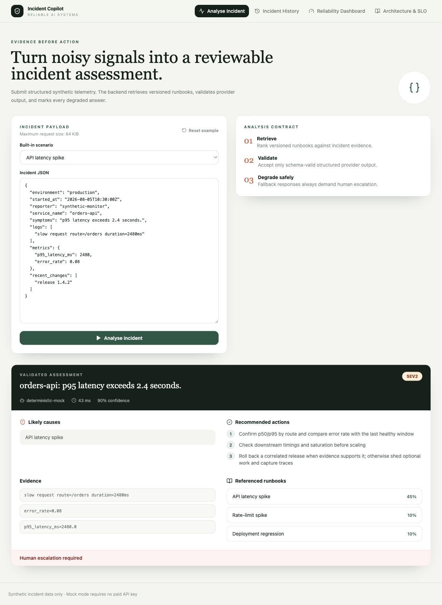
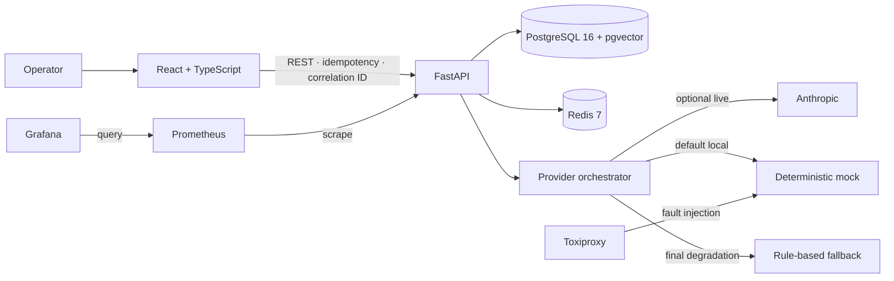
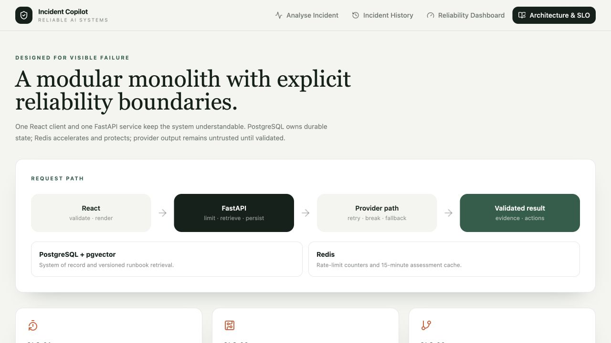
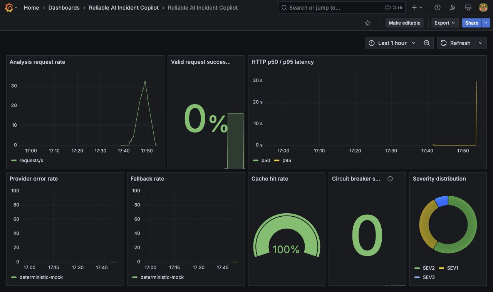

# Reliable AI Incident Copilot

[](https://github.com/enzheShen/reliable-ai-incident-copilot/actions/workflows/ci.yml)

A production-style portfolio project that turns structured service-incident telemetry into a validated, evidence-linked assessment and degrades explicitly when its AI provider fails.



_Captured from the Docker Compose stack after a real mock-provider analysis; all incident data is synthetic._

## Why this project

Incident tooling is useful only when operators can distinguish evidence from inference and normal output from degraded output. This project explores that boundary in a compact full-stack system: runbook retrieval, strict LLM output validation, durable history, and the failure controls usually omitted from chatbot demos.

The repository is deliberately a modular monolith rather than a collection of premature services. It is intended to demonstrate graduate AI software, backend, platform, and reliability engineering skills without claiming production readiness or real-company usage.

## What it does

- Accepts a constrained incident JSON contract and ships six safe synthetic examples.
- Retrieves the top versioned runbooks from PostgreSQL with pgvector.
- Produces severity, summary, likely causes, evidence, actions, confidence, escalation, provider, and runbook references.
- Persists incident and assessment history with service, severity, and status filters.
- Exposes live reliability summaries, recent reliability events, health checks, and Prometheus metrics.
- Runs without a paid key through a deterministic HTTP mock provider.
- Supports optional Anthropic live mode without storing or logging the key.
- Includes deterministic evaluation, Locust workload, and Toxiproxy failure experiments.

## Architecture





The detailed request path and trust boundaries are documented in [docs/architecture.md](docs/architecture.md).

## Reliability design

| Control | Behaviour |
| --- | --- |
| Timeout | Provider calls default to 12 seconds; configurable with `LLM_TIMEOUT_SECONDS` |
| Retry | Connection errors, 429, and 5xx only; two retries with exponential backoff and jitter |
| Circuit breaker | Opens after five consecutive failures, probes after 60 seconds, closes on probe success |
| Structured output | Pydantic validates every provider response; malformed JSON gets one correction attempt |
| Fallback | Rule-based result is labelled and always sets `requires_human_escalation=true` |
| Cache | Redis key covers normalized input, runbook versions, provider, and model; 15-minute TTL |
| Rate limit | Redis-backed, 10 analysis requests per client per minute by default |
| Idempotency | Reusing the same key and payload returns the original incident; payload drift returns 409 |
| Correlation | Safe request IDs appear in response headers, JSON logs, and request metrics |
| Input safety | 64 KiB body limit, field constraints, production CORS allowlist, sensitive log redaction |

## SLO targets

These are targets, not achieved uptime claims.

- Valid `POST /analyse` requests: **≥99.5% monthly success**; user-caused 4xx responses excluded.
- p95 analysis latency: **<3 seconds in mock mode** and **<12 seconds in live mode**, measured separately.
- When the primary provider fails: **≥95% successful fallback**.

The [SLO](docs/slo.md) and [error-budget policy](docs/error-budget.md) define indicators, burn rates, and release gates.

## Measured evaluation

`make eval` evaluates all 60 checked-in synthetic cases without a network provider. The current report was generated on 5 August 2026; it was not entered by hand.

| Metric | Measured result |
| --- | ---: |
| Severity accuracy | 100% |
| Runbook recall@1 | 100% |
| Runbook recall@3 | 100% |
| Valid structured output rate | 100% |
| Escalation accuracy | 100% |
| Average processing time | 0.243 ms |

See [reports/evaluation/latest.md](reports/evaluation/latest.md) and [latest.json](reports/evaluation/latest.json). Live Anthropic evaluation is recorded as skipped because no API key was configured.

## Load and chaos results

The following measurements came from the local Apple Silicon Docker Compose stack on 5 August 2026. They describe one controlled run, not production capacity or uptime.

| Five-minute load test | Measured result |
| --- | ---: |
| Concurrent users | 20 |
| Recorded requests | 9,700 |
| Throughput | 32.35 req/s |
| Error rate | 0% |
| p50 / p95 / p99 | 13 / 21 / 41 ms |

The measured mock-mode p95 was below the 3-second target. See the generated [load report](reports/loadtests/latest.md), [JSON](reports/loadtests/latest.json), and [Locust HTML report](reports/loadtests/latest.html).

| Provider-latency chaos experiment | Measured result |
| --- | ---: |
| Injected latency | 15,000 ms |
| Request duration | 36.446 s |
| Returned provider | `rule-based-fallback` |
| Fallback metric | 0 → 1 |
| Dependency restored | Yes |

The chaos request passed all fallback assertions, but its 36.446-second latency exposes the need for an end-to-end retry budget. One successful experiment does not establish the 95% fallback SLO. See the generated [chaos report](reports/chaos/latest.md), [JSON](reports/chaos/latest.json), and evidence-based [postmortem](docs/postmortems/001-provider-timeout.md).

### Grafana screenshot

The dashboard is provisioned from [incident-copilot.json](observability/grafana/dashboards/incident-copilot.json) with request rate, success rate, p50/p95, provider errors, fallback rate, cache hit rate, circuit state, and severity distribution.



## Run locally

Requirements: Docker Desktop with Compose v2 and GNU Make. All selected images publish ARM64-compatible builds for Apple Silicon.

```bash
git clone https://github.com/enzheShen/reliable-ai-incident-copilot.git
cd reliable-ai-incident-copilot
make bootstrap
make dev
```

`make bootstrap` creates an ignored `.env` from `.env.example`, builds images, applies Alembic migrations, and seeds 12 runbooks plus 60 synthetic incidents. Default mock mode does not need an API key.

| Service | URL |
| --- | --- |
| React application | http://localhost:5173 |
| FastAPI | http://localhost:8000 |
| Swagger UI | http://localhost:8000/docs |
| Prometheus | http://localhost:9090 |
| Grafana | http://localhost:3000 |

Stop the stack with `make stop`.

## Configuration

Copy `.env.example` to the ignored `.env` file. Important settings include:

| Variable | Default | Purpose |
| --- | --- | --- |
| `LLM_MODE` | `mock` | Selects deterministic mock or optional live mode |
| `ANTHROPIC_API_KEY` | empty | Optional paid-provider credential; never commit it |
| `ANTHROPIC_MODEL` | `claude-sonnet-4-5` | Live provider model |
| `LLM_TIMEOUT_SECONDS` | `12` | Per-attempt provider deadline |
| `CACHE_TTL_SECONDS` | `900` | Assessment cache lifetime |
| `RATE_LIMIT_PER_MINUTE` | `10` | Per-client analysis limit |
| `CIRCUIT_BREAKER_FAILURE_THRESHOLD` | `5` | Consecutive failures before opening |
| `CIRCUIT_BREAKER_RECOVERY_SECONDS` | `60` | Open interval before a half-open probe |
| `CORS_ORIGINS` | `http://localhost:5173` | Explicit browser origin allowlist |

## Development commands

```text
make bootstrap     build, migrate, and seed
make dev           start the full local stack
make stop          stop the stack
make test          backend and frontend tests
make lint          Ruff and ESLint
make typecheck     mypy and TypeScript
make eval          deterministic evaluation reports
make load-test     20-user, five-minute Locust report
make chaos-demo    Toxiproxy fallback experiment and report
make seed          idempotently seed fixed data
make migrate       apply Alembic migrations
make clean         stop services and remove local caches
```

## API example

```bash
curl -sS http://localhost:8000/api/v1/incidents/analyse \
  -H 'Content-Type: application/json' \
  -H 'Idempotency-Key: demo-api-latency-1' \
  -d '{
    "service_name": "orders-api",
    "environment": "production",
    "started_at": "2026-08-05T10:30:00Z",
    "symptoms": "p95 latency exceeds 2.4 seconds",
    "logs": ["slow request route=/orders duration=2480ms"],
    "metrics": {"p95_latency_ms": 2480, "error_rate": 0.08},
    "recent_changes": ["release 1.4.2"],
    "reporter": "synthetic-monitor"
  }'
```

The full API is available in Swagger. History responses use `{page, page_size, total, items}` and support `service`, `severity`, and `status` filters.

## Testing

`make test` passes 30 backend tests against real PostgreSQL/pgvector and Redis plus five frontend tests. The isolated code-only backend run passes 26 tests and skips four infrastructure-dependent tests when integration URLs are absent. GitHub Actions configures pgvector and Redis services so those tests execute rather than skip.

Tests verify fields and state transitions, not just status codes. The contract suite compares Pydantic fields with the TypeScript interfaces to catch undetected response drift. CI never invokes Anthropic.

## Limitations

- This version has no authentication, tenancy, or field-level encryption and must use synthetic data.
- The in-process circuit breaker is per backend process; a multi-replica deployment would require shared breaker state or coordinated routing.
- Deterministic hashing retrieval is reproducible but not a semantic embedding model.
- No monthly traffic history exists, so the SLOs remain targets; one local load run cannot establish availability.
- Load and chaos results are single-machine experiments and should not be interpreted as production capacity.
- The chaos experiment exposed a 36-second worst-path response because retries currently share no end-to-end deadline.
- There is no public deployment yet. **Live demo: not deployed.**

## Future work

- Add authentication and tenant-aware retention before accepting real incident data.
- Compare a locally hosted embedding model against deterministic retrieval on a larger evaluation set.
- Export OpenTelemetry traces and correlate provider spans with assessment IDs.
- Add a total provider deadline, then repeat the timeout experiment and compare fallback latency.
- Run scheduled load and chaos experiments in a stable CI environment.
- Add a public deployment only after cost, privacy, and abuse controls are approved.

## Documentation

- [Testing strategy](docs/testing-strategy.md)
- [Threat model](docs/threat-model.md)
- [Operator runbook](docs/runbook.md)
- [Error-budget policy](docs/error-budget.md)

MIT licensed. See [LICENSE](LICENSE).
