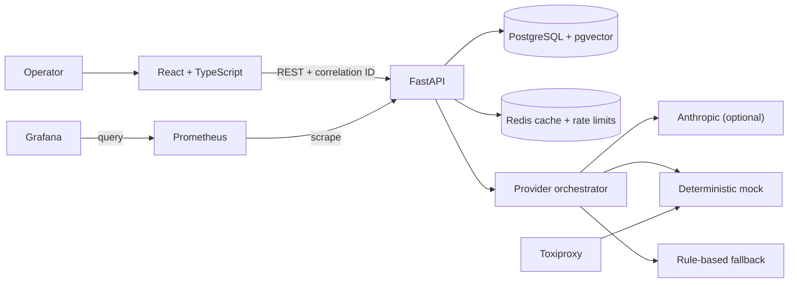

# Architecture

Reliable AI Incident Copilot is a modular monolith: one React client and one FastAPI service, backed by PostgreSQL/pgvector and Redis. This keeps the deployment understandable while preserving explicit boundaries around API, persistence, retrieval, provider, and reliability concerns.

## Request path

1. Middleware rejects oversized input, assigns a correlation ID, records latency, and recursively redacts sensitive values before structured JSON is emitted.
2. The analysis endpoint validates finite metrics and checks active idempotency replay before consuming rate-limit quota. Expired keys are removed transactionally and concurrent inserts rely on the database uniqueness constraint.
3. PostgreSQL/pgvector retrieves the most relevant versioned runbooks. Redis caches assessments using normalized incident input, runbook versions, provider, and model.
4. The provider orchestrator checks the process-local circuit breaker, then performs at most three application-managed operations. Anthropic SDK retries are disabled. Each operation uses the smaller of the 12-second attempt deadline and the remaining 15-second total budget; retry waiting also consumes that budget.
5. Pydantic validates untrusted provider output. Evidence must map to symptoms, logs, metrics, or recent changes. SEV1/SEV2, confidence below 0.70, and every fallback require human escalation.
6. The incident, assessment, runbook links, and reliability events are persisted before the validated response is returned. Unrecovered valid-request failures increment Prometheus first, then attempt a safe independent `analysis_failure` event containing only error type and stage.

## Boundaries

- PostgreSQL is the system of record. Redis data may be lost without losing incidents.
- Provider responses are untrusted input and must pass the same Pydantic schema as API output.
- The frontend never receives or stores provider credentials.
- Toxiproxy is a development/test dependency, not part of the user request path in a hosted environment.
- The circuit breaker is in process. Multiple workers would need shared breaker state or coordinated routing.
- No public deployment or live-provider evaluation is part of the checked-in evidence.
