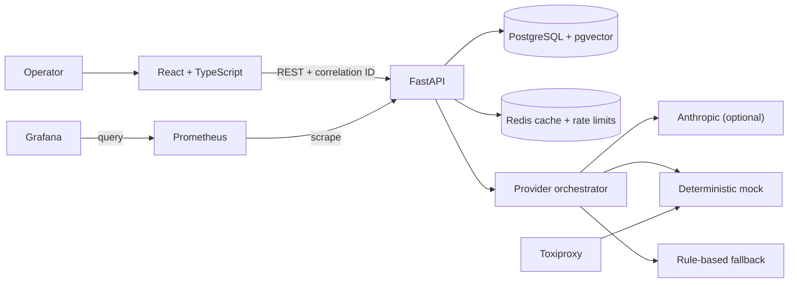

# Architecture

Reliable AI Incident Copilot is a modular monolith: one React client and one FastAPI service, backed by PostgreSQL/pgvector and Redis. This keeps the deployment understandable while preserving explicit boundaries around API, persistence, retrieval, provider, and reliability concerns.

## Request path

1. Middleware rejects oversized input, assigns a correlation ID, records latency, and redacts sensitive headers from logs.
2. The analysis endpoint validates the incident, enforces Redis-backed rate limits and idempotency, and retrieves the most relevant versioned runbooks.
3. The provider orchestrator checks cache and circuit-breaker state, validates structured provider output, retries only transient failures, and uses an explicit rule-based fallback when needed.
4. The incident, assessment, runbook links, and reliability events are persisted before the validated response is returned.

## Boundaries

- PostgreSQL is the system of record. Redis data may be lost without losing incidents.
- Provider responses are untrusted input and must pass the same Pydantic schema as API output.
- The frontend never receives or stores provider credentials.
- Toxiproxy is a development/test dependency, not part of the user request path in a hosted environment.
